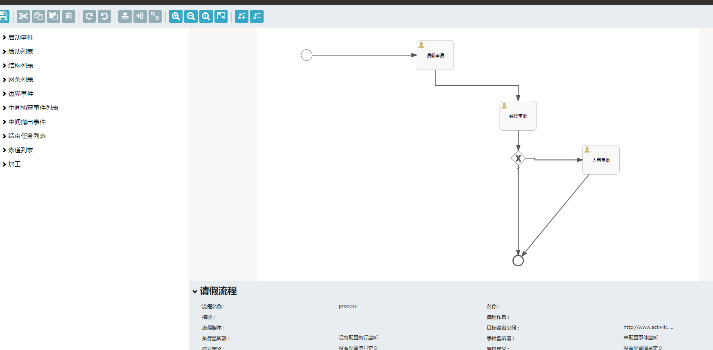
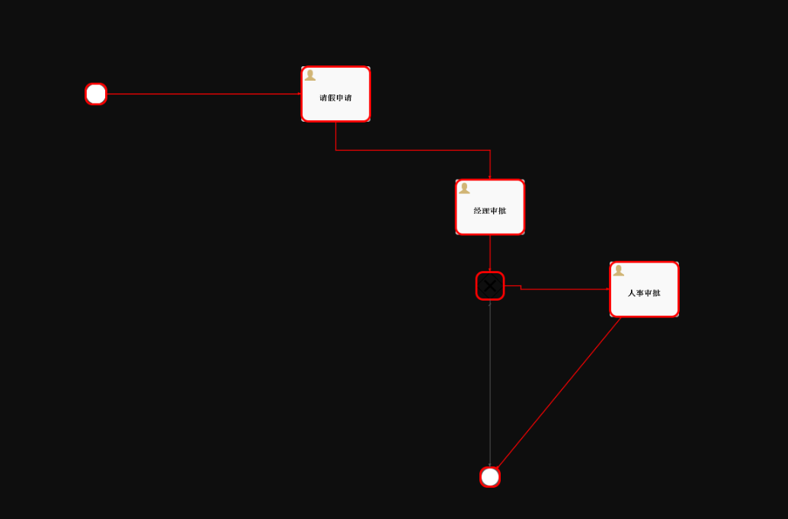
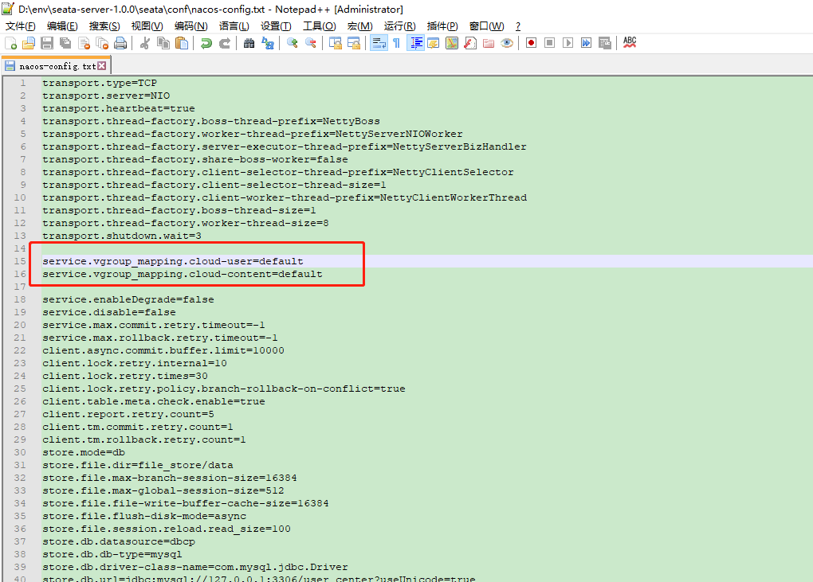
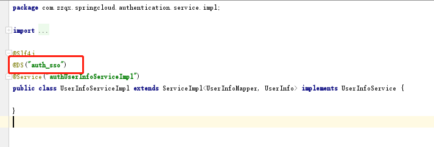

#  快速开发指南

#### 本节包含以下几部分内容。
- [开发环境说明](#开发环境说明)
- [微服务API开发](#微服务API开发)
- [WebService开发](#WebService开发)
- [工作流开发](#工作流开发)
- [大数据API开发](#大数据API开发)
- [网关路由配置](#网关路由配置)
- [限流降级配置](#限流降级配置)
- [分布式事务配置](#分布式事务配置)
- [多租户配置](#多租户配置)
- [单点登录服务配置](#单点登录服务配置)


##  开发环境说明
- 已安装 JDK 1.8.0_172 及以上版本，并且已经设置 JAVA_HOME 以及 PATH 系统变量。
- 已下载 此文档中提供的百度云链接地址中的中间件,并安装测试成功。
- 本场景满足如下软硬件配置。
| 项目 | 说明 | 
| :-----| :---- |
| CPU | 主频2.0GHz以上 | 
| 内存 | 4GB以上 |
| 硬盘 | 安装目录空间：2GB以上  |
| 操作系统 | Windows 10 |
| JDK | 1.8 |
| 浏览器 | Chrome   |
- 本场景平台部署说明示例如下。
| 系统 | URL | 
| :-----| :---- |
| nacos注册中心 | http://127.0.0.1:8848 | 
| nacos配置中心 | http://127.0.0.1:8848 |
| gateway服务网关 | http://127.0.0.1:8090  |
| sentinel熔断降级 | http//127.0.0.1:8080 |
| admin服务监控 | http://127.0.0.1:8880 |
| zipkin调用链监控 | http://127.0.0.1:9411   |
| elasticsearch | http://127.0.0.1:9200   |
| logstash | http://127.0.0.1:9600   |
| kibana日志中心 | http://127.0.0.1:5601 | 
| SSO单点登录服务 | http://127.0.0.1:8050  |
| redis | http://127.0.0.1:6379   |
| hadoop | /   |
| zookeeper | /   |
| hbase | /   |
| phoenix | /   |
| 用户中心模块 | http://127.0.0.1:8090/cloud-user |
| 内容中心模块 | http://127.0.0.1:8090/cloud-content |
| BPM流程中心模块 | http://127.0.0.1:8090/cloud-process |
| 大数据模块 | http://127.0.0.1:8090/cloud-bigdata |
| 用户中心数据库 | 127.0.0.1:3306/user_center |
| 内容中心数据库 | 127.0.0.1:3306/content_center |
| BPM流程中心数据库 | 127.0.0.1:3306/process_center |

## 微服务API开发
> 步骤一： 以user-center为例，将需要操作的单表通过代码生成插件对我们预先定义的增删改查模板进行代码生成，
> 生成之后我们就可以通过客户端来调用此服务中的接口了，Controller层代码如下
```java
package com.zzqx.springcloud.usercenter.Controller;
import com.baomidou.mybatisplus.core.conditions.query.QueryWrapper;
import com.baomidou.mybatisplus.extension.plugins.pagination.Page;
import com.zzqx.springcloud.common.util.ResponseInfo;
import com.zzqx.springcloud.usercenter.domain.model.TestTable;
import com.zzqx.springcloud.usercenter.service.TestTableService;
import org.springframework.web.bind.annotation.*;

import org.springframework.beans.factory.annotation.Autowired;
import java.io.Serializable;
import java.util.List;

/**
 * test table(TestTable)表控制层
 *
 * @author chende
 * @since 2020-04-05 15:01:46
 */
@RestController
@RequestMapping("testTable")
public class TestTableController {
    /**
     * 服务对象
     */
    @Autowired
    private TestTableService testTableService;

    /**
     * 分页查询所有数据
     *
     * @param page 分页对象
     * @param testTable 查询实体
     * @return 所有数据
     */
    @GetMapping
    public ResponseInfo selectAll(Page<TestTable> page, TestTable testTable) {
        return ResponseInfo.success(this.testTableService.page(page, new QueryWrapper<>()));
    }

    /**
     * 通过主键查询单条数据
     *
     * @param id 主键
     * @return 单条数据
     */
    @GetMapping("{id}")
    public ResponseInfo selectOne(@PathVariable Serializable id) {
        return ResponseInfo.success(this.testTableService.getById(id));
    }

    /**
     * 新增数据
     *
     * @param testTable 实体对象
     * @return 新增结果
     */
    @PostMapping
    public ResponseInfo insert(@RequestBody TestTable testTable) {
        return ResponseInfo.success(this.testTableService.save(testTable));
    }

    /**
     * 修改数据
     *
     * @param testTable 实体对象
     * @return 修改结果
     */
    @PutMapping
    public ResponseInfo update(@RequestBody TestTable testTable) {
        return ResponseInfo.success(this.testTableService.updateById(testTable));
    }

    /**
     * 删除数据
     *
     * @param idList 主键结合
     * @return 删除结果
     */
    @DeleteMapping
    public ResponseInfo delete(@RequestParam("idList") List<Long> idList) {
        return ResponseInfo.success(this.testTableService.removeByIds(idList));
    }
}
```

> 步骤二： 如果此服务中的接口需要暴露给nacos注册中心中的其他服务调用的话，那么我们需要将服务提供方想要
> 暴露的api接口定义在interface模块下的对应子模块user-interface中，这个子模块中只需要定义实体类与接口，
> 然后我们需要在user-center中的Controller层实现接口，并且在model实体中继承user-interface的实体类。

> 步骤三： 在服务调用方需要去定义一个user-interface中定义的接口的实现类A类，并配置feign映射注解，然后我们就可以
> 在Controller层中注入A类并且调用对应feign配置服务的接口了。  
> 这里给出一个feign配置的demo代码

```java
package com.zzqx.springcloud.usercenter.feignclient.api.contentcenter;

import com.zzqx.springcloud.facade.contentcenter.api.NoticeApi;
import com.zzqx.springcloud.facade.contentcenter.model.BaseNotice;
import com.zzqx.springcloud.usercenter.feignclient.fallback.NoticeFeignClientFallback;
import org.springframework.cloud.openfeign.FeignClient;
import org.springframework.cloud.openfeign.SpringQueryMap;
import org.springframework.web.bind.annotation.*;

import java.util.List;

/**
 * feign面向接口远程调用多种参数形式
 */
@FeignClient(value = "cloud-content",fallbackFactory = NoticeFeignClientFallback.class)
public interface NoticeFeignClient extends NoticeApi<BaseNotice> {

    /**
     * 空参数调用
     * @return
     */
    @RequestMapping("notice/list")
    public List<BaseNotice> noticeList();

    /**
     * 对象封装的调用
     * @param notice
     * @return
     */
    @PostMapping("notice/save")
    public  Boolean save(@RequestBody BaseNotice notice);

    /**
     * 多参数调用
     * @param username
     * @param password
     * @return
     */
    @GetMapping("notice/getParam")
    public String getParam(@RequestParam("username") String username, @RequestParam("password") String password);

    /**
     * url中的参数与springmvc相同
     */
    @GetMapping("notice/get/{id}")
    public String getSingleParam(@PathVariable String id);
}
```

## WebService开发
?> WebService代码在soa-center子模块中，我们将WebService写在对应模块中，WebService有两种实现方式： rest方式/soap方式
> rest风格WebService如下  
> 步骤一：定义WebService接口 

```java
package com.zzqx.springcloud.userservice.webservice.rs;


import javax.ws.rs.*;

@Path(value = "/UserInfoServiceRS")
public interface UserInfoServiceRS {
	@GET
	@Path(value = "/{id}/info")
	@Produces({"application/json","application/xml"})
	String findUserInfoById(@PathParam("id") String id);

	@GET
	@Path(value = "/search")
	@Produces({"application/json","application/xml"})
	String findAll();

	@POST
	@Path(value = "/login")
	@Produces({"application/json","application/xml"})
	String login(@QueryParam("userName")String userName , @QueryParam("password")String password);

	@POST
	@Path(value = "/authentication")
	@Produces({"application/json"})
	String authentication(@HeaderParam("token") String token);
}

```

> 步骤二：定义WebService接口的实现类
```java
package com.zzqx.springcloud.userservice.webservice.rs.impl;

import com.alibaba.fastjson.JSON;
import com.alibaba.fastjson.serializer.SerializerFeature;
import com.baomidou.mybatisplus.core.conditions.query.LambdaQueryWrapper;
import com.baomidou.mybatisplus.core.conditions.query.QueryWrapper;
import com.google.common.collect.Maps;
import com.zzqx.springcloud.commonservice.constant.GlobalConstant;
import com.zzqx.springcloud.commonservice.domain.dto.ResponseInfo;
import com.zzqx.springcloud.commonservice.util.JwtOperator;
import com.zzqx.springcloud.userservice.domain.model.UserInfo;
import com.zzqx.springcloud.userservice.service.UserInfoService;
import com.zzqx.springcloud.userservice.webservice.rs.UserInfoServiceRS;
import io.jsonwebtoken.Claims;
import io.swagger.annotations.Api;
import org.apache.commons.lang3.StringUtils;
import org.springframework.beans.factory.annotation.Autowired;
import org.springframework.beans.factory.annotation.Value;
import org.springframework.data.redis.core.RedisTemplate;
import org.springframework.http.HttpStatus;
import org.springframework.stereotype.Service;

import java.util.List;
import java.util.Map;
import java.util.concurrent.TimeUnit;

@Api("/UserInfoServiceImplRS")
@Service
public class UserInfoServiceImplRS implements UserInfoServiceRS {
	@Autowired
	private UserInfoService userInfoService ;

	@Autowired
	private JwtOperator jwtOperator;

	@Autowired
	private RedisTemplate redisTemplate;

	@Value("${expire-time-in-second}")
	private Long tokenExpireSecond;

	@Override
	public String findUserInfoById(String id) {
		UserInfo userInfo = userInfoService.getById(id);
		ResponseInfo responseInfo = ResponseInfo.success(userInfo);
		return JSON.toJSONString(responseInfo, SerializerFeature.WriteMapNullValue);
	}

	@Override
	public String findAll() {
		List<UserInfo> list = userInfoService.list(new QueryWrapper<>());
		ResponseInfo responseInfo = ResponseInfo.success(list);
		return JSON.toJSONString(responseInfo, SerializerFeature.WriteMapNullValue);
	}

	@Override
	public String login(String userName, String password){
		if(StringUtils.isEmpty(userName) || StringUtils.isEmpty(password)){
			ResponseInfo responseInfo = ResponseInfo.error(HttpStatus.INTERNAL_SERVER_ERROR.value(),"无效参数");
			return JSON.toJSONString(responseInfo, SerializerFeature.WriteMapNullValue);
		}

		UserInfo userInfo = userInfoService.getOne(new LambdaQueryWrapper<UserInfo>()
				.eq(UserInfo::getUserName,userName)
				.eq(UserInfo::getPassword,password)
		);

		Map jwtMap = Maps.newHashMap();
		jwtMap.put("id", userInfo.getId());
		jwtMap.put("userName", userInfo.getUserName());
		jwtMap.put("role", userInfo.getRole());

		//生成jwtToken
		String tokenStr =  jwtOperator.generateToken(jwtMap);

		//三十分钟有效
		redisTemplate.opsForValue().set(GlobalConstant.PRE_TOKEN_STR + userInfo.getUserName(),tokenStr,tokenExpireSecond, TimeUnit.SECONDS);

		//统一响应
		ResponseInfo responseInfo = ResponseInfo.success(tokenStr,null);
		return JSON.toJSONString(responseInfo, SerializerFeature.WriteMapNullValue);
	}


	/**
	 * token认证
	 * @param token
	 * @return
	 */
	@Override
	public String authentication(String token) {
		String username = null ;
		boolean pass = true ;
		try {
			//验证token有效性
			if(StringUtils.isEmpty(token) ||  !jwtOperator.validateToken(token) ){
				pass = false;
			}
			if(pass){
				Claims claims = jwtOperator.getClaimsFromToken(token);
				username = claims.get("userName").toString();
				//验证缓存有效性
				if(!(redisTemplate.hasKey(GlobalConstant.PRE_TOKEN_STR + username)
						&& redisTemplate.opsForValue().get(GlobalConstant.PRE_TOKEN_STR + username).toString().equals(token))){
					pass = false;
				}
			}
		} catch (Exception e) {
			//统一响应
			ResponseInfo responseInfo = ResponseInfo.error(HttpStatus.INTERNAL_SERVER_ERROR.value(),e.getMessage(),pass);
			return JSON.toJSONString(responseInfo, SerializerFeature.WriteMapNullValue);
		}
		//统一响应
		ResponseInfo responseInfo = ResponseInfo.success(pass);
		return JSON.toJSONString(responseInfo, SerializerFeature.WriteMapNullValue);
	}
}

``` 

> 步骤三：在CXFConfig配置文件中修改发布WebService配置
```java
class CXFConfig{
    //JAX-RS发布
    	@Bean
    	public Server restfullServer() {
    		JAXRSServerFactoryBean endpoint = new JAXRSServerFactoryBean();
    		endpoint.setBus(springBus());
    		endpoint.setAddress("/MyServiceRS");
    		endpoint.setServiceBeans(Arrays.<Object>asList(userInfoServiceRS));
    		endpoint.setFeatures(Arrays.asList(new Swagger2Feature()));
    		return endpoint.create();
    	}
}
```

> soap协议WebService如下  
> 步骤一：定义RestService接口 
```java
package com.zzqx.springcloud.userservice.webservice.ws;


import javax.jws.WebMethod;
import javax.jws.WebParam;
import javax.jws.WebService;

@WebService(name = "UserInfoServiceWS", targetNamespace = "http://webservice.ws.zzqx.com/")
public interface UserInfoServiceWS {

	@WebMethod(action = "http://webservice.ws.zzqx.com/findUserInfoById")
	String findUserInfoById(@WebParam(name = "_para",targetNamespace = "http://webservice.ws.zzqx.com/") String _para);

	@WebMethod(action = "http://webservice.ws.zzqx.com/findAll")
	String findAll(@WebParam(name = "_para",targetNamespace = "http://webservice.ws.zzqx.com/") String _para);

	@WebMethod(action = "http://webservice.ws.zzqx.com/login")
	String login(@WebParam(name = "_para",targetNamespace = "http://webservice.ws.zzqx.com/") String _para);

	@WebMethod(action = "http://webservice.ws.zzqx.com/authentication")
	String authentication(@WebParam(name = "_para",targetNamespace = "http://webservice.ws.zzqx.com/") String _para);
}

```

> 步骤一：定义WebService接口的实现类
```java
package com.zzqx.springcloud.userservice.webservice.ws.impl;

import com.alibaba.fastjson.JSON;
import com.alibaba.fastjson.JSONObject;
import com.alibaba.fastjson.serializer.SerializerFeature;
import com.baomidou.mybatisplus.core.conditions.query.LambdaQueryWrapper;
import com.baomidou.mybatisplus.core.conditions.query.QueryWrapper;
import com.google.common.collect.Maps;
import com.zzqx.springcloud.commonservice.constant.GlobalConstant;
import com.zzqx.springcloud.commonservice.domain.dto.ResponseInfo;
import com.zzqx.springcloud.commonservice.util.JwtOperator;
import com.zzqx.springcloud.userservice.domain.model.UserInfo;
import com.zzqx.springcloud.userservice.service.UserInfoService;
import com.zzqx.springcloud.userservice.webservice.ws.UserInfoServiceWS;
import io.jsonwebtoken.Claims;
import org.apache.commons.lang3.StringUtils;
import org.springframework.beans.factory.annotation.Autowired;
import org.springframework.beans.factory.annotation.Value;
import org.springframework.data.redis.core.RedisTemplate;
import org.springframework.http.HttpStatus;
import org.springframework.stereotype.Component;

import javax.jws.WebService;
import java.util.List;
import java.util.Map;
import java.util.concurrent.TimeUnit;

@WebService(serviceName = "UserInfoServiceWS",
		targetNamespace = "http://webservice.ws.zzqx.com/",
		endpointInterface = "com.zzqx.springcloud.userservice.webservice.ws.UserInfoServiceWS"
)
@Component
public class UserInfoServiceImplWS implements UserInfoServiceWS {

	@Autowired
	private UserInfoService userInfoService ;

	@Autowired
	private JwtOperator jwtOperator;

	@Autowired
	private RedisTemplate redisTemplate;

	@Value("${expire-time-in-second}")
	private Long tokenExpireSecond;

	@Override
	public String findUserInfoById(String _para) {
		//参数转JSON
		JSONObject dataJson = JSONObject.parseObject(_para);

		//获取验证密钥
		String id = dataJson.getString("id");

		UserInfo userInfo = userInfoService.getById(id);
		//统一响应
		ResponseInfo responseInfo = ResponseInfo.success(userInfo);
		return JSON.toJSONString(responseInfo, SerializerFeature.WriteMapNullValue);
	}

	@Override
	public String findAll(String _para) {

		List<UserInfo> list = userInfoService.list(new QueryWrapper<>());
		//统一响应
		ResponseInfo responseInfo = ResponseInfo.success(list);
		return JSON.toJSONString(responseInfo, SerializerFeature.WriteMapNullValue);
	}

	@Override
	public String login(String _para) {

		//参数转JSON
		JSONObject dataJson = JSONObject.parseObject(_para);

		//获取验证密钥
		String userName = dataJson.getString("userName");
		String password = dataJson.getString("password");

		if(StringUtils.isEmpty(userName) || StringUtils.isEmpty(password)){
			ResponseInfo responseInfo = ResponseInfo.error(HttpStatus.INTERNAL_SERVER_ERROR.value(),"无效参数");
			return JSON.toJSONString(responseInfo, SerializerFeature.WriteMapNullValue);
		}

		UserInfo userInfo = userInfoService.getOne(new LambdaQueryWrapper<UserInfo>()
				.eq(UserInfo::getUserName,userName)
				.eq(UserInfo::getPassword,password)
		);

		Map jwtMap = Maps.newHashMap();
		jwtMap.put("id", userInfo.getId());
		jwtMap.put("userName", userInfo.getUserName());
		jwtMap.put("role", userInfo.getRole());

		//生成jwtToken
		String tokenStr =  jwtOperator.generateToken(jwtMap);

		//三十分钟有效
		redisTemplate.opsForValue().set(GlobalConstant.PRE_TOKEN_STR + userInfo.getUserName(),tokenStr,tokenExpireSecond, TimeUnit.SECONDS);

		//统一响应
		ResponseInfo responseInfo = ResponseInfo.success(tokenStr,null);
		return JSON.toJSONString(responseInfo, SerializerFeature.WriteMapNullValue);
	}

	/**
	 * token认证
	 * @return
	 */
	@Override
	public String authentication(String _para) {

		//参数转JSON
		JSONObject dataJson = JSONObject.parseObject(_para);

		//获取验证密钥
		String token = dataJson.getString("token");
		String username = null ;
		boolean pass = true ;
		try {
			//验证token有效性
			if(StringUtils.isEmpty(token) ||  !jwtOperator.validateToken(token) ){
				pass = false;
			}
			if(pass){
				Claims claims = jwtOperator.getClaimsFromToken(token);
				username = claims.get("userName").toString();
				//验证缓存有效性
				if(!(redisTemplate.hasKey(GlobalConstant.PRE_TOKEN_STR + username)
						&& redisTemplate.opsForValue().get(GlobalConstant.PRE_TOKEN_STR + username).toString().equals(token))){
					pass = false;
				}
			}
		} catch (Exception e) {
			//统一响应
			ResponseInfo responseInfo = ResponseInfo.error(HttpStatus.INTERNAL_SERVER_ERROR.value(),e.getMessage(),pass);
			return JSON.toJSONString(responseInfo, SerializerFeature.WriteMapNullValue);
		}
		//统一响应
		ResponseInfo responseInfo = ResponseInfo.success(pass);
		return JSON.toJSONString(responseInfo, SerializerFeature.WriteMapNullValue);
	}
}
```

> 步骤三：在CXFConfig配置文件中修改发布WebService配置
```java
class CXFConfig{
	//JAX-WS发布
	@Bean
	public Endpoint WSServer() {
		EndpointImpl endpoint = new EndpointImpl(springBus(), userInfoServiceWS);
		endpoint.publish("/UserInfoServiceWS");
		return endpoint;
	}
}
```

## 工作流开发
> 步骤一： 启动process-center模块，进入Activiti在线编辑器设计流程

   

> 步骤二： 流程设计完成之后即可调用activiti提供的api发布流程  
> 不熟悉API请参考离线文档，文档链接：https://pan.baidu.com/s/1qzK6_c4JGFiM0vgGcVn1Pw 提取码：4qts。

> 步骤三： 流程发布之后即可创建流程实例，如： 小明想提交请假单，则进入平台填写请假单，点击保存时候会根据发布的流程
> 创建流程实例，流程实例会携带一个叫做businessKey的参数，此参数用于关联业务单据与流程数据。
> 部分流程控制代码demo如下，还有很多其他接口，请自行查阅文档或博客

```java

/**
 * 发布流程
 */
@RestController
@RequestMapping("process")
public class ProcessController implements RestServiceController<Deployment, String> {
    @Autowired
    RepositoryService repositoryService;

    @Autowired
    RuntimeService runtimeService;

    @Autowired
    TaskService taskService;


    @Autowired
    private HistoryService historyService;

    @Autowired
    private ProcessEngineConfiguration processEngineConfiguration;

    @Override
    public Object getOne(@PathVariable("id") String id) {
        Deployment deployment = repositoryService.createDeploymentQuery().deploymentId(id).singleResult();
        return ToWeb.buildResult().setObjData(new DeploymentResponse(deployment));
    }

    @Override
    public Object getList(@RequestParam(value = "rowSize", defaultValue = "1000", required = false) Integer rowSize, @RequestParam(value = "page", defaultValue = "1", required = false) Integer page) {
        List<Task> tasks = taskService.createTaskQuery()
                .listPage(rowSize * (page - 1), rowSize);
        long count = taskService.createTaskQuery().count();
        List<TaskResponse> list = new ArrayList<>();

//        Set<String> taskIds = list.stream().map( TaskResponse::getId).collect(Collectors.toSet());

//        List<Deployment> deployments = repositoryService.createDeploymentQuery().list();

        for(Task task: tasks){
            list.add(TaskResponse.builder()
                    .assignee(task.getAssignee())
                    .deploymentTime(task.getCreateTime())
                    .id(task.getId())
                    .name(task.getName())
                    .build());
        }

        return ToWeb.buildResult().setRows(
                ToWeb.Rows.buildRows()
                        .setRowSize(rowSize)
                        .setTotalPages((int) (count/rowSize+1))
                        .setTotalRows(count)
                        .setList(list)
                        .setCurrent(page)
        );
    }

    @PostMapping("executions")
    public Object getExecutions(@RequestParam(value = "rowSize", defaultValue = "1000", required = false) Integer rowSize, @RequestParam(value = "page", defaultValue = "1", required = false) Integer page) {
        List<ProcessInstance> tasks = runtimeService.createProcessInstanceQuery()
                .listPage(rowSize * (page - 1), rowSize);
        long count = taskService.createTaskQuery().count();
        List<TaskResponse> list = new ArrayList<>();

        List<HistoricProcessInstance> historicProcessInstances = historyService.createHistoricProcessInstanceQuery().listPage(rowSize * (page - 1), rowSize);

//        Set<String> taskIds = list.stream().map( TaskResponse::getId).collect(Collectors.toSet());

//        List<Deployment> deployments = repositoryService.createDeploymentQuery().list();

        for(ProcessInstance task: tasks){
            list.add(TaskResponse.builder()
                    .id(task.getId())
                    .name(task.getName())
                    .build());
        }

        for(HistoricProcessInstance task: historicProcessInstances){
            list.add(TaskResponse.builder()
                    .id(task.getId())
                    .name(task.getName())
                    .build());
        }

        return ToWeb.buildResult().setRows(
                ToWeb.Rows.buildRows()
                        .setRowSize(rowSize)
                        .setTotalPages((int) (count/rowSize+1))
                        .setTotalRows(count)
                        .setList(list)
                        .setCurrent(page)
        );
    }


    @Override
    public Object deleteOne(@PathVariable("id") String id) {
        repositoryService.deleteDeployment(id);
        return ToWeb.buildResult().refresh();
    }

    @PostMapping("{id}/right")
    public Object right(@PathVariable("id") String id) {

        //使用正确的审批人执行任务

        String rightUser = "admin";


        Task task = taskService.createTaskQuery().taskId(id).taskAssignee(rightUser).singleResult();

        Map param = new HashMap();
        param.put("days",3);
        if (task != null)
            taskService.complete(task.getId(),param);
        else
            throw new IllegalArgumentException("该用户不存在此任务");
        return ToWeb.buildResult().refresh();
    }

    @PostMapping("{id}/fault")
    public Object fault(@PathVariable("id") String id) {
        //使用错误的审批人执行任务

        String faultUser = "00";

        Task task = taskService.createTaskQuery().taskId(id).taskAssignee(faultUser).singleResult();


        if (task != null)
            taskService.complete(task.getId());
        else
            throw new IllegalArgumentException("该用户不存在此任务");
        return ToWeb.buildResult().refresh();
    }

    @GetMapping(value = "{id}/progress",produces = MediaType.IMAGE_JPEG_VALUE)
    @ResponseBody
    public byte[]  progress(@PathVariable("id") String id, HttpServletResponse response) throws IOException {
//        Task task = taskService.createTaskQuery().taskId(id).singleResult();

        //根据任务id获取流程实例id
//        ProcessInstance processInstance = runtimeService.createProcessInstanceQuery().processInstanceId(task.getProcessInstanceId()).singleResult();

        //获取历史流程实例
        HistoricProcessInstance processInstance =  historyService.createHistoricProcessInstanceQuery().processInstanceId(id).singleResult();

        //获取流程图
        BpmnModel bpmnModel = repositoryService.getBpmnModel(processInstance.getProcessDefinitionId());

        ProcessDiagramGenerator diagramGenerator = processEngineConfiguration.getProcessDiagramGenerator();
        ProcessDefinitionEntity definitionEntity = (ProcessDefinitionEntity)repositoryService.getProcessDefinition(processInstance.getProcessDefinitionId());

        List<HistoricActivityInstance> highLightedActivitList =  historyService.createHistoricActivityInstanceQuery().processInstanceId(id).list();
        //高亮环节id集合
        List<String> highLightedActivitis = new ArrayList<String>();

        //高亮线路id集合
        List<String> highLightedFlows = ActivityDemoServiceImpl.getHighLightedFlows(definitionEntity,highLightedActivitList);

        for(HistoricActivityInstance tempActivity : highLightedActivitList){
            String activityId = tempActivity.getActivityId();
            highLightedActivitis.add(activityId);
        }
        //配置字体
        InputStream is = diagramGenerator.generateDiagram(bpmnModel, "png", highLightedActivitis, highLightedFlows,"宋体","微软雅黑","黑体",null,2.0);

        byte[] bytes = new byte[is.available()];
        is.read(bytes, 0, is.available());
        return bytes;

    }
}
```

   

?> 使用流程管理平台之后，我们不在需要在代码中硬编码流程走向判断条件，不在担心流程节点单据的变更与升级，能够实现高可靠的自动化流程管理。
使用此平台我们只需要自己设计各个节点上的表单，流程走向完全由BPM引擎来管理。

## 大数据API开发

!> 敬请期待...

## 网关路由配置
?> gateway为我们提供了一系列内置路由规则，当然我们也可以自定义规则，实现方法请自行百度或博客搜索。

> 步骤一： 修改gateway网关模块下的配置文件,下面列举了一个例子  
> 规则： 当localhost:8090/cloud-content被访问时，如果时间在2019-04-29至2090-05-01之间则会被转发到nacos的cloud-content服务上

```yaml
spring:
  cloud:
    #网关配置
    gateway:
      discovery:
        locator:
          #开启路由默认规则
          enabled: true
        #配置路由规则
      routes:
        - id: cloud-content
          uri: lb://cloud-content
          predicates:
            - Between=2019-04-29T00:00:00+08:00[Asia/Shanghai], 2090-05-01T00:00:00+08:00[Asia/Shanghai]
```

## 限流降级配置
?> 限流降级配置存在两种解决方案，硬编码方式/控制台配置

> 控制台配置  
> 步骤一：进入http//127.0.0.1:8080配置熔断降级规则，操作方法请自行百度搜索

## 分布式事务配置
> 步骤一：在需要使用全局事务的Service实现类方法上增加@GlobalTransactional注解，并确保业务库中已经添加了`undo_log`表

> 步骤二：在中间件`seata-server-1.0.0\seata\conf\nacos-config.txt`中添加需要使用到分布式事务的服务名称即可

   

## 多租户配置
> 步骤一：在yml中配置数据源连接，以下样例配置为通用连接池参数以及user、auth_sso两个租户数据库的配置
```yaml
spring:
  #数据源配置
  datasource:
    dynamic:
      #全局连接池配置
      druid:
        initialSize: 5
        minIdle: 5
        maxActive: 20
        maxWait: 60000
        timeBetweenEvictionRunsMillis: 60000
        minEvictableIdleTimeMillis: 300000
        validationQuery: SELECT 1
        testWhileIdle: true
        testOnBorrow: true
        testOnReturn: false
        poolPreparedStatements: true
        maxPoolPreparedStatementPerConnectionSize: 20
        filters: stat,wall
        connectionProperties: druid.stat.mergeSql=true;druid.stat.slowSqlMillis=5000
        stat-view-servlet:
          allow: 127.0.0.1
      datasource:
        user:
          username: root
          #密码：123456
          password: ENC(Y3ycHCcZGa+N+OK+qXTWA0gJ1L1N+FYrswTgRQEegdKVTefiujYxjlytR6zOuV5Y3AifL/P10yWshYKQaqpkkQ==)
          driver-class-name: com.mysql.cj.jdbc.Driver
          url: jdbc:mysql://127.0.0.1:3306/user_center?useUnicode=true&characterEncoding=utf-8&allowMultiQueries=true&useSSL=false&serverTimezone=Asia/Shanghai
        auth_sso:
          username: root
          #密码：123456
          password: ENC(Y3ycHCcZGa+N+OK+qXTWA0gJ1L1N+FYrswTgRQEegdKVTefiujYxjlytR6zOuV5Y3AifL/P10yWshYKQaqpkkQ==)
          driver-class-name: com.mysql.cj.jdbc.Driver
          url: jdbc:mysql://127.0.0.1:3306/user_center?useUnicode=true&characterEncoding=utf-8&allowMultiQueries=true&useSSL=false&serverTimezone=Asia/Shanghai
``` 
> 步骤二：静态数据源配置 在Service实现层类名或方法名上硬编码@DS("租户名称")即可连接此租户，方法上注解优于类上注解

   

>步骤三：动态数据源配置 在Service实现层类名或方法名上硬编码@DS("#thread.key")即可连接线程中获取到的key对应的value（租户名称）的租户，核心代码如下

```java
package com.zzqx.springcloud.processcenter.datasource;//package com.zzqx.springcloud.authentication.datasource;

import com.baomidou.dynamic.datasource.processor.DsProcessor;
import com.zzqx.springcloud.common.datasource.LocalThread;
import org.aopalliance.intercept.MethodInvocation;

/**
 * 线程中取租户名称
 */
public class DsCommonProcessor extends DsProcessor {

    private static final String HEADER_PREFIX = "#thread";


    @Override
    public boolean matches(String key) {

        return key.startsWith(HEADER_PREFIX);
    }

    @Override
    public String doDetermineDatasource(MethodInvocation invocation, String key) {
        Object obj = LocalThread.getLocalThreadValue(key.substring(8));
        return obj == null ? "" :obj.toString();
    }
}
```

## 单点登录服务配置
> 步骤一：在需要使用CAS单点登录的模块配置中增加SSO客户端名称、服务端地址、客户端地址
```yaml
#cas配置
cas:
  client-name: cloud-user
  server:
    url: http://127.0.0.1:8050/cas
  project:
    url: http://127.0.0.1:8081
```

> 步骤二： 在`ShiroConfig.loadShiroFilterChain`方法中配置需要使用cas过滤器`securityFilter`拦截的路径即可