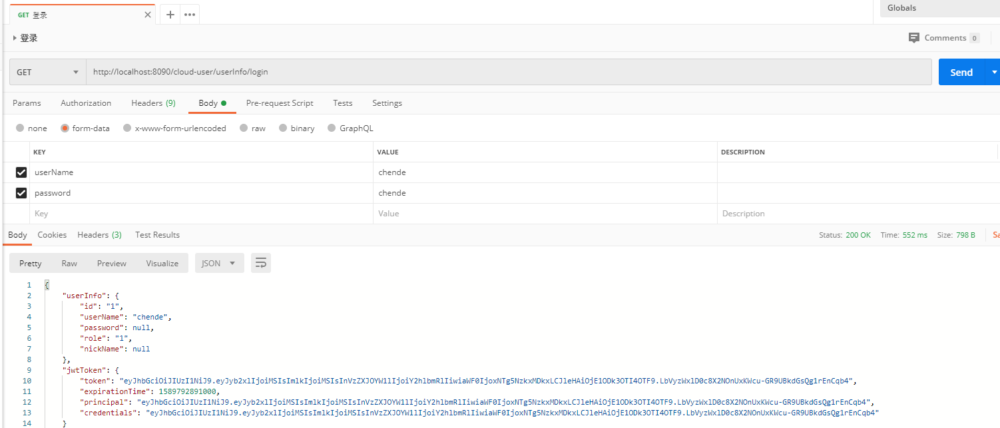
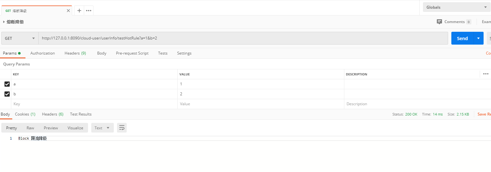
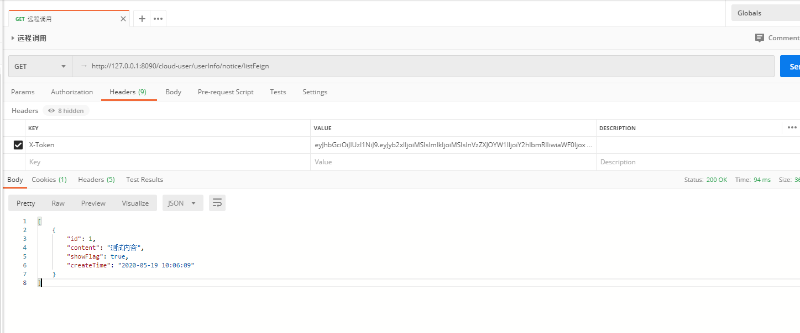
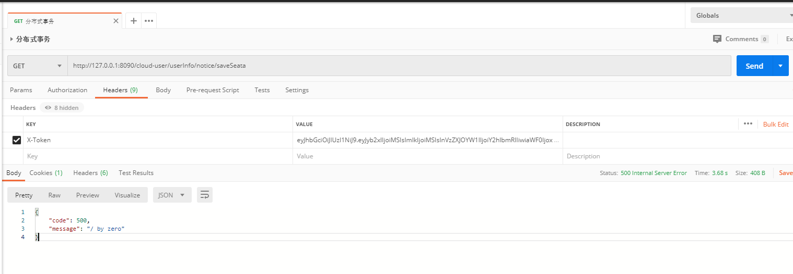
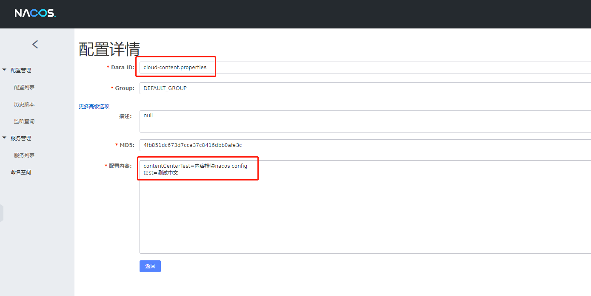
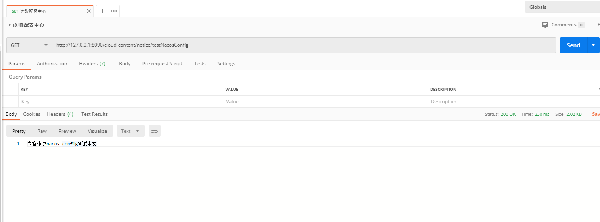

#  案例参考


#### 本节包含以下几部分内容。
- [测试环境地址](#测试环境地址)
- [接口清单](#接口清单)
- [jwt登录](#jwt登录)
- [熔断降级样例](#熔断降级样例)
- [远程调用样例](#远程调用样例)
- [分布式事务样例](#分布式事务样例)
- [读取配置中心样例](#读取配置中心样例)

## 测试环境地址

| 说明 | 服务地址 | 网关地址 |
| :-----| :---- | :---- | 
| 网关模块 |  http://119.96.230.241:8554 | http://119.96.230.241:8554 |
| 系统模块 |  http://119.96.230.241:8552 | http://119.96.230.241:8554/cloud-system | 
| 服务监控 |  http://119.96.230.241:8553 | http://119.96.230.241:8554/monitor | 
| 流程中心 |  http://119.96.230.241:8551/model-list.html | http://119.96.230.241:8554/cloud-process/model-list.html | 
| 单点登录平台 |   http://119.96.230.241:8555/cas/login  | / | 
| 流控降级控制台 |  http://119.96.230.241:8224 | / | 
| ELK日志管理控制台 |  http://119.96.230.241:8222 | / |
| 配置中心控制台 |  http://119.96.230.241:8848/nacos/#/login | / |  
| 调用链监控控制台 |  http://119.96.230.241:8225/zipkin/ | / |    

## 接口清单
!> 引导样例如下,响应参数规范统一按照TestTableController类；默认网关http://127.0.0.1:8090/

| 说明 | 接口 | 
| :-----| :---- | 
| jwt登录 |  http://127.0.0.1:8090/cloud-system/userInfo/login |  
| 熔断降级样例 | http://127.0.0.1:8090/cloud-system/userInfo/testHotRule | 
| 远程调用样例 | http://127.0.0.1:8090/cloud-system/userInfo/notice/listFeign  | 
| 分布式事务样例 | http://127.0.0.1:8090/cloud-system/userInfo/notice/saveSeata | 
| 读取配置中心样例 | http://127.0.0.1:8090/cloud-content/notice/testNacosConfig |  

##  jwt登录
?> 登录响应token需以X-Token为key存储到请求头中,用于接口认证鉴权。

 

## 熔断降级样例

 

> 熔断降级接口核心代码如下

```java
class NoticeController{ 
      /**
         * SentinelResource ：指定热点资源名称级异常处理类和方法 defaultFallback通常为全局异常处理
         * @param a
         * @param b
         * @return
         */
        @GetMapping("testHotRule")
        @SentinelResource(value = "testHotRule",
                blockHandler = "testHotRuleBlock",
                blockHandlerClass = UserInfoSentinelBlock.class,
                fallback = "testHotRuleFallback",
                fallbackClass = UserInfoSentinelFallback.class
    //            defaultFallback = ""
        )
        public String testHotRule(String a ,String b){
    
            if(StringUtils.isEmpty(b)){
                throw new IllegalArgumentException("非法参数");
            }
            return a + ":" + b;
        }
}
```

> 限流降级熔断异常处理核心代码如下
```java
class UserInfoSentinelBlock {

    /**
     * 拦截限流降级熔断异常 ，先于fallback
     * @param a
     * @param b
     * @param exception
     * @return
     */
    public static String testHotRuleBlock(String a, String b, BlockException exception){
        log.error("Block 限流降级了{}",exception.getMessage());
        return "Block 限流降级";
    }
}
```

> 异常响应处理核心代码如下，若指定了block异常处理则不会执行此异常拦截
```java
class UserInfoSentinelFallback {

    /**
     * 回滚异常，处理指定方法中的任何异常
     * @param a
     * @param b
     * @param throwable
     * @return
     */
    public static String testHotRuleFallback(String a ,String b, Throwable throwable){
        log.error("Fallback 服务发生异常{}",throwable.getMessage());
        return "Fallback 服务发生异常，参数a:" + a + ",b:" + b;
    }
}
```

## 远程调用样例
?> 使用FeignClient组件 + nacos注册中心实现服务间远程调用

 

> FeignClient调用三方服务API时处理限流降级的核心代码如下

```java
/**
 * FallbackFactory 实现
 * feign sentinel若设置fallback 则不会进入全局异常
 */
public class NoticeFeignClientFallback implements FallbackFactory<NoticeFeignClient> {
    @Override
    public NoticeFeignClient create(Throwable throwable) {
        log.error("feign sentinel 发生限流降级或异常{}",throwable);


        //由于fallback会覆盖全局异常、所以抛出一个异常做统一响应
        if(throwable instanceof FeignException.Unauthorized){
            FeignException.Unauthorized unauthorized = (FeignException.Unauthorized) throwable;
            String body = unauthorized.contentUTF8();
            JSONObject json = JSONObject.parseObject(body);
            log.info(json.toJSONString());
            throw new InternalApiException(HttpStatus.valueOf(unauthorized.status()),json.getInteger("code"),
                    json.getString("message"));
        }
        if(throwable instanceof FeignException.InternalServerError){
            FeignException.InternalServerError internalServerError = (FeignException.InternalServerError) throwable;
            String body = internalServerError.contentUTF8();

            JSONObject json = JSONObject.parseObject(body);
            log.info(json.toJSONString());
            throw new InternalApiException(HttpStatus.valueOf(internalServerError.status()),json.getInteger("code"),
                    json.getString("message"));
        }
        if(throwable.getCause() instanceof SocketTimeoutException){
            SocketTimeoutException socketTimeoutException = (SocketTimeoutException) throwable.getCause();
            String body = socketTimeoutException.getMessage();
            throw new InternalApiException(HttpStatus.INTERNAL_SERVER_ERROR,HttpStatus.INTERNAL_SERVER_ERROR.value(),body);
        }

        return new NoticeFeignClient() {
            @Override
            public List<BaseNotice> noticeList() {
                log.info("feign sentinel Fallback 重写");
                return null;
            }

            @Override
            public Boolean save(BaseNotice notice) {
                log.info("feign sentinel Fallback 重写");
                return null;
            }

            @Override
            public String getParam(String username, String password) {
                log.info("feign sentinel Fallback 重写");
                return null;
            }

            @Override
            public String getSingleParam(String id) {
                log.info("feign sentinel Fallback 重写");
                return null;
            }
        };
    }
}

```

## 分布式事务样例

 

> 分布式事务核心配置如下,需要使用分布式事务的服务都需要在nacos中增加如下配置

 

> 分布式事务核心代码如下，调用方service层上声明seata的全局事务注解，可以不写spring的事务注解
```java
public class UserInfoServiceImpl{

    /**
     * 调用方service层声明seata的全局事务注解，可以不写spring的事务注解
     * @return
     */
    @Override
//    @Transactional(rollbackFor = Exception.class)
    @GlobalTransactional
    public Object noticeSaveSeata() {
        UserInfo user = new UserInfo();
        user.setNickName("陈德");
        user.setUserName("123456");
        super.save(user);

        BaseNotice notice = new BaseNotice();
        notice.setContent("123");
        notice.setCreateTime(new Date());
        notice.setShowFlag(false);
        Object obj = noticeFeignClient.save(notice);
        log.info("响应信息{}", JSONObject.toJSONString(obj));
        return obj;
    }
}
```

## 读取配置中心样例
?> 读取nacos配置中心中的配置

 

 
